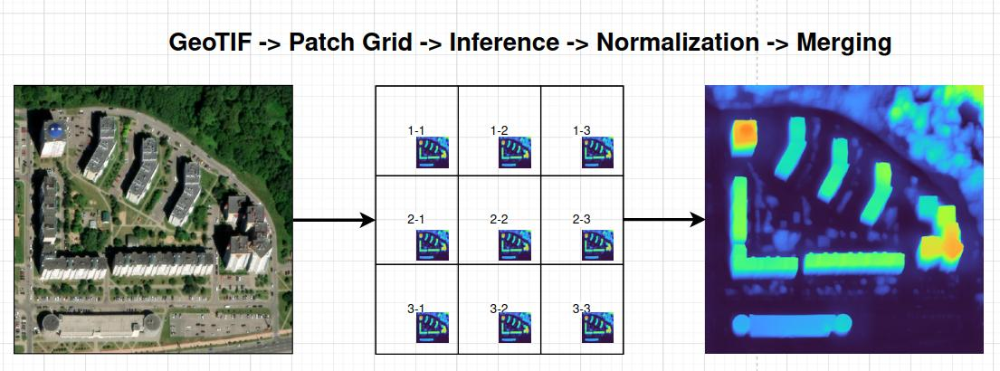
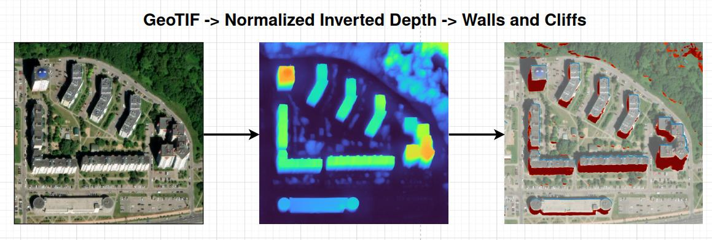
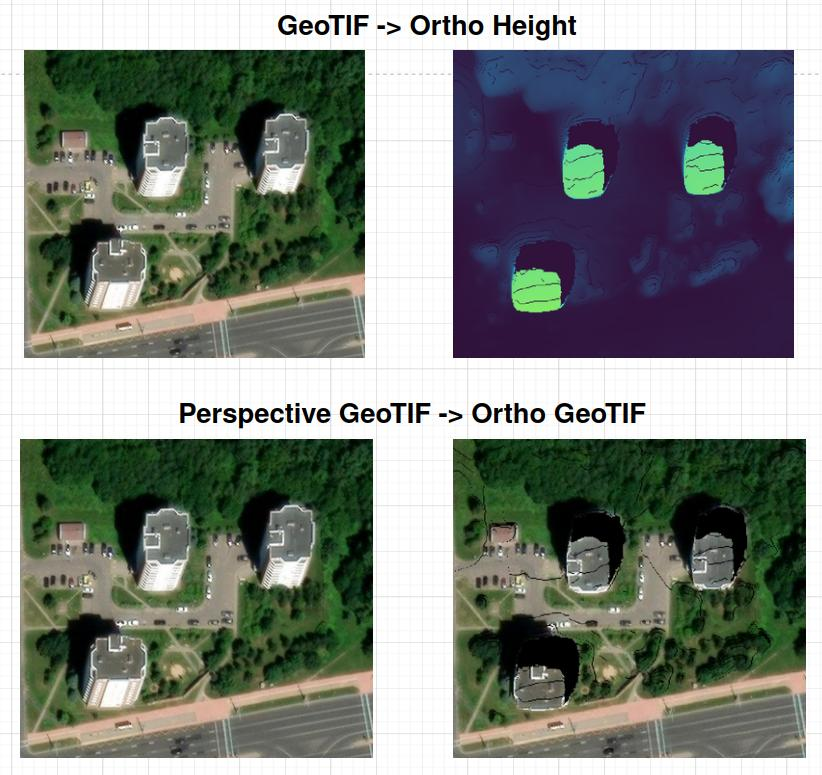
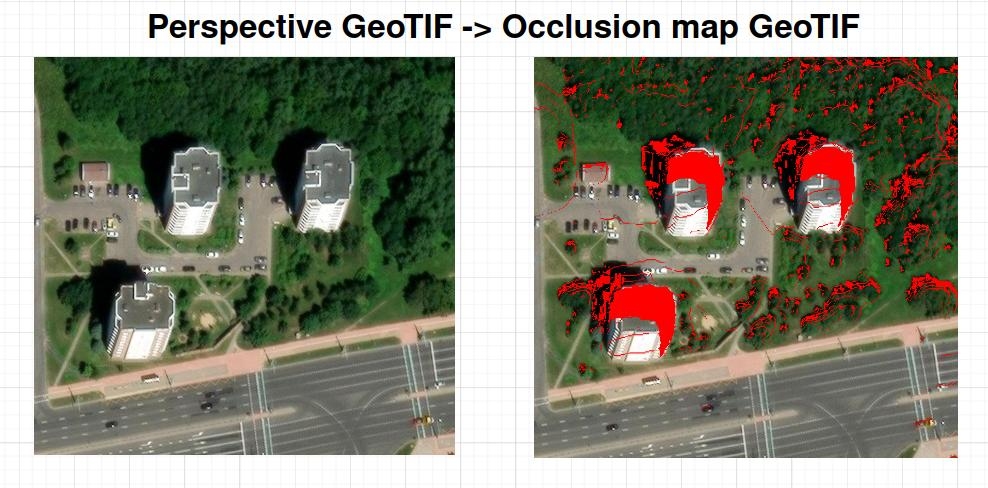
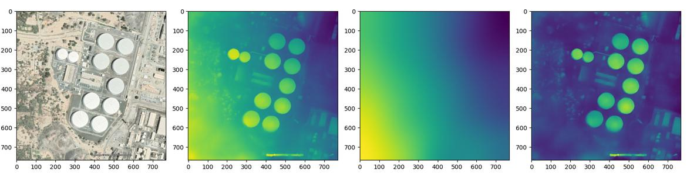
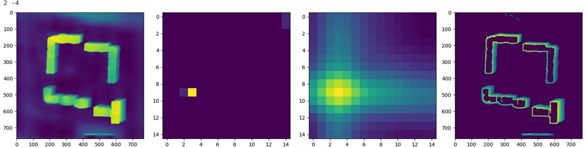
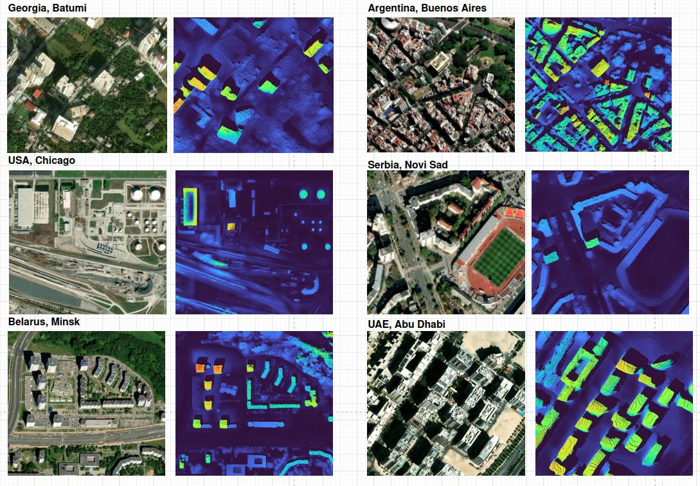

# Monodepth Satellite Toolbox
*Pipeline to process satellite imagery with Monocular Depth neural networks*

This repo is the next iteration in the development of https://github.com/aliaksandr960/maps_screenshot_to_3d

# Usage:
- *python pipeline.py 'path to reconstruction folder'*, reconstruction folder should have *'raster.tif'* file
- use jupyter-notebook and *pipeline.ipynb* file.

Both files have a dictionary with configuration so that you can adjust it.

Best use with Z18 scale, or about 0.6m GSD.

It looks like analytics and orthophoto generation may require a significant amount of RAM and are not fully optimized yet. Please check your available memory, and if it's insufficient, consider splitting the reconstruction into smaller regions.

## This toolbox can:
1. **Split big GeoTIF images on patches, process each patch with a monocular depth model and normalizer results and save them as GeoTIF images**

2. **Segment wall and сliffs**

3. **Ortho from Perspective images**

4. **Occlusion map, to see what cannot be seen**

## Algorithms Description:

#### 1. split.py

- Grabs GeoTiff split it into overlapping patches.

#### 2. depthmaps.py

- Perform monocular depth estimation for each patch using **Apple DepthPro** or **Meta Depth Anything** models **(configurable)**.

- Relays on **HuggingFace Transformers** module, so it could be easy to integrate any model available on **HuggingFace**.

#### 3. heightmaps.py

- Invert depth maps.

- Do min-pooling and smoothing to estimate background bias.

- Subtract the background from the inverted depth.

*Could be a problem in really large buildings.*

#### 4. directions.py

- Slice inverted depth with high gradients by some number of levels.

- Skeletonize and cross-correlate levels between each other.

- Max cross-correlation is the view direction.

#### 5. basic_analytics.py

- After having a view direction, it is possible to estimate sub-vertical surfaces and normalize inverted depth maps.

- Calculate walls and cliffs.

#### 6. merge_analytics.py
- Overlapping patches merging using center-distance weighting to minimize visible differences between them.

#### 7. ortho.py
- Convert analytics and raster to point cloud -> transform -> store as color.tif and height.tif

- Zero values in ortho depict occlusions.

## Tests

Due I not found any specific datasets, I just grabbed 6 images form all around the world.

If ortho looks fine - it means height estimation and depth are also fine.

I used the Meta Depth Anything V2 model because it is more CPU-friendly.

Across all six samples, none failed completely. Directions were calculated quite accurately in every case. There were some issues, such as inaccurately segmented walls in Batumi and background removal problems for the Chicago warehouse. However, overall, everything looks reasonably good.

 # Licensing:
 - The code is released under the MIT License.
 - File *'test_reconstruction/raster.tif'* is a screenshot from Google Maps. Its usage should comply with Google Maps' Terms of Service."
 - Model weights and dependencies are licensed by their respective authors.
