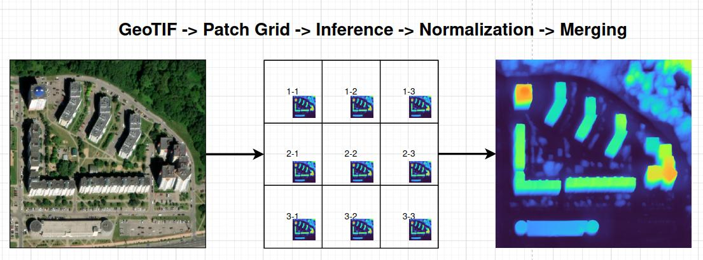
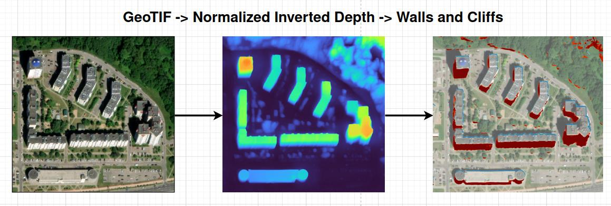
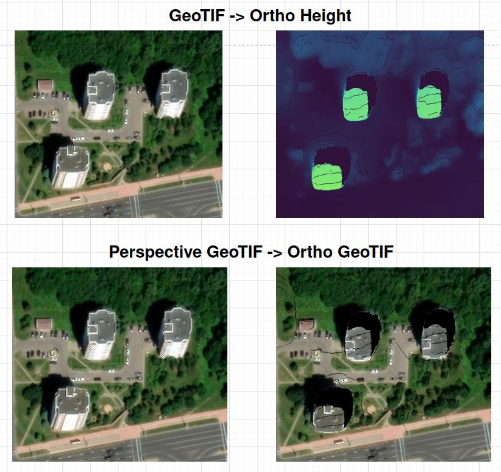
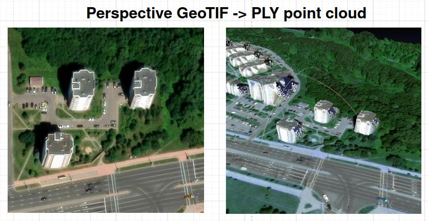
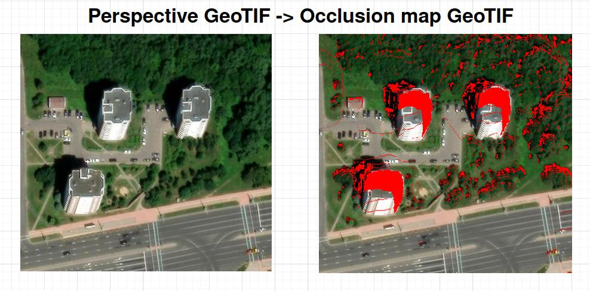
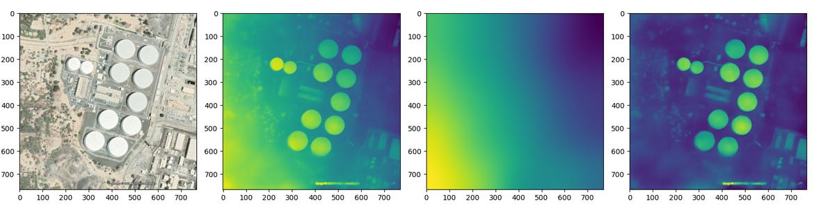
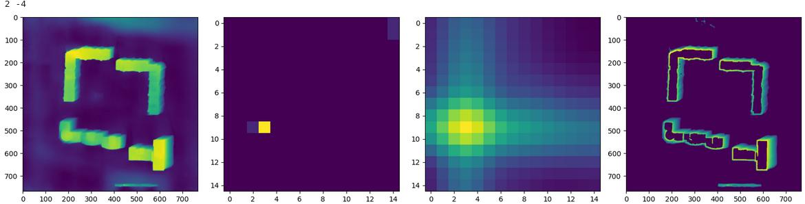

# Monodepth Satellite Toolbox
**Pipeline to process satellite imagery with Monocular Depth neural networks**

This repo is the next iteration in the development of https://github.com/aliaksandr960/maps_screenshot_to_3d

# Usage:
- *python pipeline.py 'path to reconstruction folder'*, reconstruction folder should have *'raster.tif'* file
- use jupyter-notebook and *pipeline.ipynb* file.

Both files have a dictionary with configuration so that you can adjust it.

Best use with Z18 scale, or about 0.6m GSD and not a very big GeoTIF, due some algorithms put it on RAM.

**Unfortunately, these algorithms do not provide height measurements in metric units. Instead, they estimate relative height as pixel distances between the perspective and orthographic views. To obtain height in meters, a scaling procedure is required.**

# Recostruction file structure:
#### Input and output:
- **`raster.tif`: Input GeoTIF with perspectie satellite image.**
- `analytics/`:
    - `falls.tif`: GeoTIF with cliffs (falls)
    - `walls.tif`: GeoTIF with walls or sub-vertical surfaces
    - `normalized_heightmap.tif`: Merged heightmap normalized from 0 to 1.
    - `directions.json`: Averaged view direction across all patches.
- `ortho/`:
    - `color.tif`: GeoTIF with ortho view.
    - `height.tif`: GeoTIF with distances in pixels from perspective view to ortho view. To conver to metric value must be scaled.
    - `occlusion.tif`: GeoTIF with occlusion map.
    - `transformed_point_array.npy`: Point cloud coordinates as np.array, without fall (cliff) points. Z value - distances in pixels from perspective view to ortho view
    - `color_array.npy`: Point cloud colors as np.array, without fall (cliff) points.

- `pointcloud/`:
    - `point_cloud.ply`: PLY file with colored pointcloud, z value means distance in pixels from perspective view to ortho view. To conver to metric value must be scaled.

#### Internal files:
- `patches/`:  Input file splitte on patches.     
- `depathmaps/`: Patches after processing by monocular depth estimation model.
- `heightmaps/`: Inverted depthmaps without background, scaled from 0 to 1.
- `directions/`: View directions from heightmaps.

# This toolbox can:
1. **Split big GeoTIF images on patches, process each patch with a monocular depth model and normalizer results and save them as GeoTIF images**

2. **Segment wall and сliffs**

3. **Ortho from Perspective images**

4. **Point cloud from Perspective images**

5. **Occlusion map, to see what cannot be seen**

## Algorithms Description:

#### 1. split.py

- Grabs GeoTiff split it into overlapping patches.

#### 2. depthmaps.py

- Perform monocular depth estimation for each patch using **Apple DepthPro** or **Meta Depth Anything** models **(configurable)**.

- Relays on **HuggingFace Transformers** module, so it could be easy to integrate any model available on **HuggingFace**.

#### 3. heightmaps.py

- Invert depth maps.

- Do min-pooling and smoothing to estimate background bias.

- Subtract the background from the inverted depth.

*Could be a problem in really large buildings.*

#### 4. directions.py

- Slice inverted depth with high gradients by some number of levels.

- Skeletonize and cross-correlate levels between each other.

- Max cross-correlation is the view direction.

#### 5. basic_analytics.py

- After having a view direction, it is possible to estimate sub-vertical surfaces and normalize inverted depth maps.

- Calculate walls and cliffs.

#### 6. merge_analytics.py
- Overlapping patches merging using center-distance weighting to minimize visible differences between them.

#### 7. ortho.py
- Convert analytics and raster to point cloud -> transform -> store as color.tif and height.tif.

- Zero values in ortho depict occlusions.

#### 8. point_cloud.py
- Convert generated points to PLY point cloud.

# Updates:

**Update 20 Jul 2025:**

- Fixed size limit of 3840 pixels.
- Added multiprocessing to heightmaps estimation (speedup on multicore CPU-s).
- Fixed unstable work with some GeoTIF profiles.
- Added generation of PLY pointclouds.
- Added generation of 'occlustion.tif' as a separate GeoTIF file.
- Reduced abount of memory used by ortho generation.
- Improved documentation.
- Made more tests to estimate solution perfomance.
    

 # Licensing:
 - The code is released under the MIT License.
 - File *'test_reconstruction/raster.tif'* is a screenshot from Google Maps. Its usage should comply with Google Maps' Terms of Service."
 - Model weights and dependencies are licensed by their respective authors.
